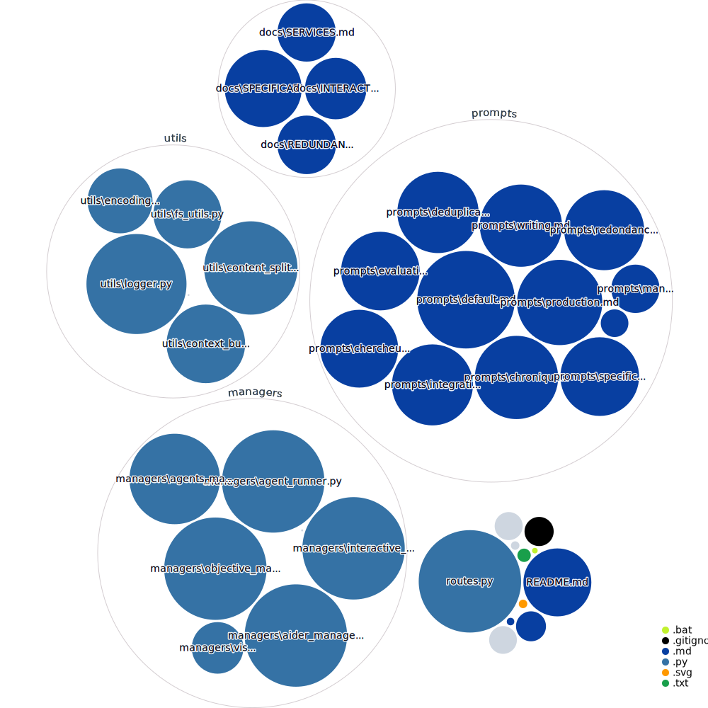

# KinOS v6 - AI Team Orchestration System

## 🌟 Overview

KinOS is an advanced AI team orchestration system that enables autonomous collaboration between specialized AI agents. It uses a file-based architecture to coordinate multiple GPT-4 agents working together on complex projects.

See it in action: https://nlr.ai/

## ✨ Key Features

- 🤖 **Autonomous Agent Teams**: Pre-configured specialized teams for different project types
- 📁 **Directory-Based Operation**: Uses current directory as mission context
- 🔄 **Dynamic Resource Management**: Automatic scaling and resource allocation
- 🔍 **Intelligent Content Management**: Built-in deduplication and content organization
- 🔗 **Git Integration**: Automatic version control and change tracking
- 📊 **Progress Monitoring**: Real-time status tracking and logging

## 📊 Project Structure


## 💡 Best Practices

### Mission Definition
- Be extremely specific about expected outputs and deliverables
- Include clear format and structure requirements
- Define validation criteria and constraints
- Example: Instead of "Create documentation", specify "Generate HTML docs from Python docstrings into /docs with search function"

### Repository Preparation
- Add relevant reference materials and examples as text files
- Structure directories to match expected output
- Include any required templates or configurations

### Interactive Guidance
- Use `kin interactive` to open chat sessions with the project
- Guide work in progress and clarify requirements
- Review and refine implementations

## 🚀 Getting Started

### Prerequisites

- Python 3.8+
- OpenAI API key
- Perplexity API key (for research capabilities)
- Git installed
- Node.js and npm installed (for repository visualization)

### Installation

1. Clone the repository:
```bash
git clone https://github.com/Lesterpaintstheworld/kinos.git
cd kinos
```

2. Install Aider locally:
```bash
git clone git@github.com:Aider-AI/aider.git
cd aider
pip install -e .
cd ..
```

3. Install dependencies:
```bash
pip install -r requirements.txt

# Clone and setup repo-visualizer
git clone https://github.com/githubocto/repo-visualizer.git
cd repo-visualizer

# Create dist directory
mkdir dist

# Install dependencies with legacy peer deps flag
npm install --legacy-peer-deps

# Install esbuild globally
npm install -g esbuild

# Update package.json build script to:
# "build": "npx esbuild --target=es2019 ./src/index.jsx --bundle --platform=node --outfile=dist/index.js"

# Build the project
npm run build

cd ..
```

4. Set up environment variables:
```bash
# Create .env file
OPENAI_API_KEY=your_openai_key_here
PERPLEXITY_API_KEY=your_perplexity_key_here
```

4. Add KinOS to your PATH:
   - **Windows**: Add the KinOS directory to your system's PATH environment variable
   - **Linux/Mac**: Create a symbolic link to the `kin` script in /usr/local/bin

### Starting Your First Project

1. Create a new project directory:
```bash
mkdir my_project
cd my_project
```

2. Create a aider.mission.md file:
```bash
# Create .aider.mission.md file
# This file describes what you want to accomplish
# Example content:
"""
# Project Mission: Create a Python Web Scraper

## Objective
Build a web scraper that can:
- Extract data from e-commerce websites
- Save results to CSV files
- Handle pagination and rate limiting
- Respect robots.txt

## Requirements
- Use Python with BeautifulSoup
- Include error handling
- Add comprehensive documentation
- Create unit tests
"""
```

3. Launch KinOS:
```bash
# Generate and start 6 parallel agents
kin run agents --generate --count 6
```

4. Monitor Progress:
- Check `suivi.md` for detailed logs
- View `diagram.svg` for your repository diagram 
- Review `todolist.md` for pending tasks

## 📖 Usage

### Basic Commands

```bash
# Launch with default configuration (uses gpt-4o-mini)
kin run agents

# Launch with specific model (currently supports gpt-4o-mini only - you can try ollama/llama3.1:70B or similar, but feature is untested)
kin run agents --model gpt-4o-mini

# Generate new agents
kin generate agents

# Launch an interactive session with the project
kin interactive
```

### Required Environment Variables
```bash
OPENAI_API_KEY=your_openai_key_here        # Required for all operations
PERPLEXITY_API_KEY=your_perplexity_key_here # Required for research capabilities
```

### Common Operations

1. **Start a New Project**
```bash
# Create project directory
mkdir my_project
cd my_project

# Create mission file
echo "Project mission details..." > .aider.mission.md

# Launch KinOS
kin run agents --generate

# add --verbose to any command to get more info
```

## 🛠️ Core Components

### Agent Types

1. **SpecificationAgent**: Requirements analysis and documentation
2. **ManagementAgent**: Project coordination and resource allocation
3. **RedactionAgent**: Content creation and documentation
4. **EvaluationAgent**: Quality assurance and testing
5. **DeduplicationAgent**: Content organization and redundancy management
6. **ChroniqueurAgent**: Progress tracking and logging
7. **RedondanceAgent**: Backup and consistency management
8. **ProductionAgent**: Code/content generation
9. **ChercheurAgent**: Research and analysis
10. **IntegrationAgent**: System integration and deployment

### Possible Use-cases

- 📚 Book Writing
- 🔬 Literature Reviews
- 💻 Coding
-  Business Plans
- Company Documentation

## 🤝 Contributing

We welcome contributions! Feel free to reach out directly to me: contact on https://nlr.ai/

### Development Guidelines

- Follow existing code patterns
- Add comprehensive documentation
- Include tests for new features
- Update README for significant changes

## 📄 License

This project is licensed under the MIT License - see the LICENSE file for details.

## 🙏 Acknowledgments

- Aider for enabling AI-assisted development
- The AutonomousAI community for pioneering autonomous AI development
- Claude for being an awesome collaborator

## 📞 Support

- Telegram: https://t.me/+KfdkWFNZoONjMTE0
- Patreon: https://www.patreon.com/c/kins_autonomousais/membership
- Website: https://nlr.ai/

## 🔮 Future Plans

- Ollama full support
- Packaged version
- GUI
- General improvments, especially about convergence

---

Made with ❤️ by NLR, Claude & the KinOS Community
